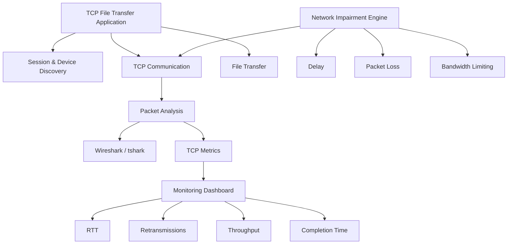
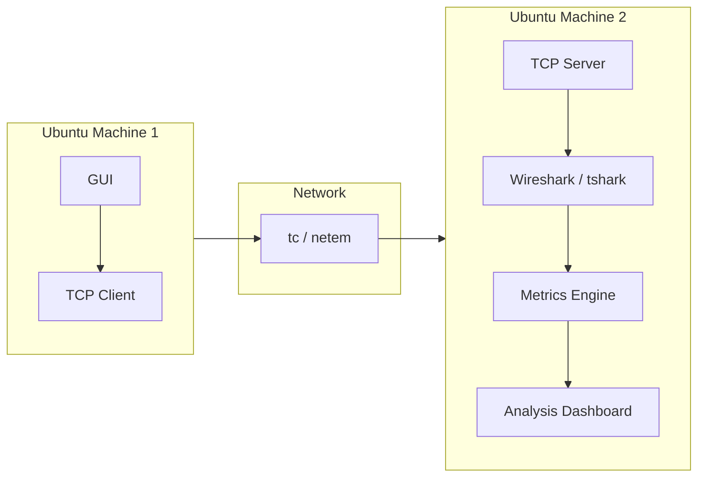
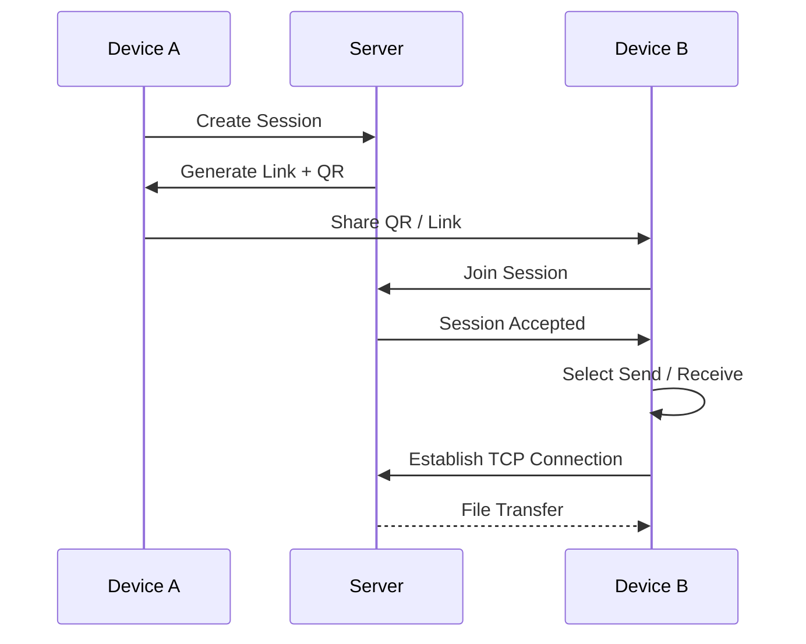
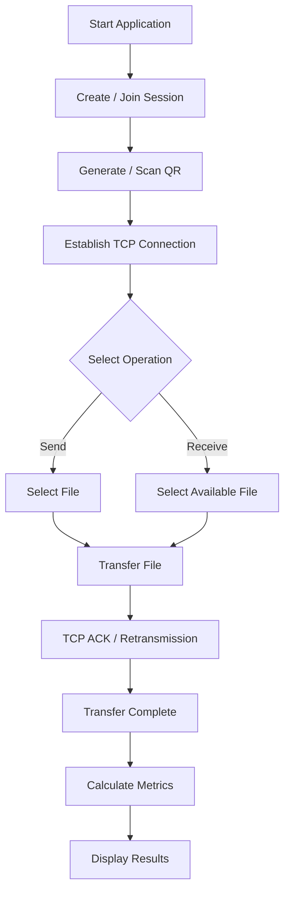
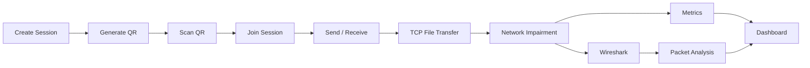

# TCP Reliability and Performance under Network Impairments

## 1. Project Title

**TCP Reliability and Performance under Network Impairments**

---

## 2. Original Problem Statement

> Introduce controlled delay, packet loss, and bandwidth limits between a client and server. Analyse TCP connection establishment, retransmissions, throughput, and file-transfer completion time.

---

## 3. Enhanced Project Problem Statement

Modern network applications are expected to reliably transfer data even when the underlying network experiences delay, packet loss, congestion, and bandwidth limitations. TCP provides reliable, ordered data delivery using connection establishment, acknowledgements, sequence numbers, retransmissions, and congestion-control mechanisms.

This project develops a TCP-based file-transfer system using two Ubuntu machines, enhanced with a user-friendly GUI and QR/link-based device discovery. One device can create a transfer session and generate a connection link or QR code. Another device can join the session by scanning the QR code or entering the generated link and then select whether to send or receive a file.

The system introduces controlled network impairments such as delay, packet loss, and bandwidth limitations using Linux networking tools. Network traffic is captured and analysed using Wireshark/tshark to identify TCP connection establishment, acknowledgements, retransmissions, duplicate ACKs, and other TCP behaviour.

The project measures and compares RTT, retransmissions, throughput, and file-transfer completion time under normal and impaired network conditions.

---

## 4. Objectives

1. Implement a TCP client-server file-transfer system.
2. Establish communication between two Ubuntu machines.
3. Provide GUI-based session creation and file-transfer controls.
4. Generate a link/QR code for device discovery.
5. Allow connected devices to select Send or Receive.
6. Introduce controlled network delay.
7. Introduce controlled packet loss.
8. Introduce bandwidth limitations.
9. Capture and analyse TCP traffic using Wireshark/tshark.
10. Measure RTT, retransmissions, throughput, and file-transfer completion time.
11. Compare TCP performance under different network conditions.
12. Present results through a monitoring dashboard.

---

## 5. CO Mapping

### Primary CO: CO1

Relevant topics:

- Internet protocol stack
- TCP/UDP sockets
- Socket programming
- Packet capture and analysis
- Protocol-aware networking tools
- Debugging network applications

---

## 6. High-Level Architecture



---

## 7. Two-Machine Architecture



---

## 8. QR / Link-Based Connection

The QR code is used for discovery and session joining, not as the TCP transfer mechanism.



Example connection information:

```text
http://192.168.1.20:5000/join/AB12CD
```

---

## 9. File Transfer Workflow



---

## 10. TCP Connection Analysis

```text
Client                         Server

  |                              |
  | -------- SYN --------------> |
  | <------ SYN + ACK ---------- |
  | -------- ACK --------------> |
  |                              |
  | -------- Request ----------> |
  |                              |
  | <------- File Data --------- |
  | ----------- ACK -----------> |
  |                              |
  | <------- File Data --------- |
  |                              |
  | ----------- ACK -----------> |
  |                              |
```

---

## 11. Network Impairments

### Delay

Example values:

```text
50 ms
100 ms
200 ms
```

### Packet Loss

Example values:

```text
1%
2%
5%
```

### Bandwidth

Example values:

```text
10 Mbps
5 Mbps
1 Mbps
```

---

## 12. Experimental Scenarios

| Experiment | Delay | Loss | Bandwidth |
|---|---:|---:|---:|
| Baseline | 0 ms | 0% | Unlimited |
| Delay-1 | 50 ms | 0% | Unlimited |
| Delay-2 | 100 ms | 0% | Unlimited |
| Delay-3 | 200 ms | 0% | Unlimited |
| Loss-1 | 0 ms | 1% | Unlimited |
| Loss-2 | 0 ms | 2% | Unlimited |
| Loss-3 | 0 ms | 5% | Unlimited |
| Bandwidth-1 | 0 ms | 0% | 10 Mbps |
| Bandwidth-2 | 0 ms | 0% | 5 Mbps |
| Bandwidth-3 | 0 ms | 0% | 1 Mbps |
| Combined | 100 ms | 2% | 5 Mbps |

---

## 13. Metrics

The project measures:

- TCP connection establishment time
- RTT
- TCP retransmissions
- Duplicate ACKs
- Throughput
- File-transfer completion time
- File integrity

---

## 14. Wireshark Analysis

Useful filters:

```text
tcp
```

```text
tcp.analysis.retransmission
```

```text
tcp.analysis.duplicate_ack
```

```text
tcp.flags.syn == 1
```

```text
tcp.port == 5000
```

---

## 15. Dashboard

The server/analysis machine should display:

```text
+------------------------------------------------------+
|              TCP NETWORK ANALYZER                    |
+------------------------------------------------------+
| Connection                                           |
| Client: 192.168.1.10                                 |
| Server: 192.168.1.20                                 |
| Status: CONNECTED                                    |
+------------------------------------------------------+
| Network Conditions                                   |
| Delay:       100 ms                                  |
| Packet Loss: 2 %                                     |
| Bandwidth:   5 Mbps                                  |
+------------------------------------------------------+
| TCP Metrics                                          |
| RTT:               108 ms                            |
| Retransmissions:   17                               |
| Duplicate ACKs:    24                               |
| Throughput:        4.31 Mbps                         |
+------------------------------------------------------+
| File Transfer                                        |
| File: testfile.bin                                   |
| Size: 100 MB                                         |
| Progress: █████████████████░░░ 85%                  |
| Completion Time: 184.2 sec                          |
+------------------------------------------------------+
```

---

## 16. Technology Stack

### OS

- Ubuntu Linux

### Application

- Python 3
- TCP sockets
- FastAPI or Flask
- HTML/CSS/JavaScript
- QR code generation

### Networking

- iproute2
- tc
- netem
- iperf3
- ss
- tcpdump

### Packet Analysis

- Wireshark
- tshark

### Visualization

- Matplotlib or Plotly

### Development

- Git
- GitHub
- VS Code

---

## 17. Three-Person Work Distribution

### Member 1 — TCP Application & File Transfer

Responsibilities:

- TCP client
- TCP server
- Socket communication
- File transfer
- Send/Receive
- Session management
- QR/link generation
- File integrity

### Member 2 — Network Impairment & Experimentation

Responsibilities:

- tc/netem
- Delay injection
- Packet-loss injection
- Bandwidth limitation
- Network configuration
- Experiment automation
- Test scenarios
- Performance measurement

### Member 3 — Packet Analysis & Dashboard

Responsibilities:

- Wireshark
- tshark
- tcpdump
- TCP packet analysis
- Retransmission detection
- RTT extraction
- Metrics processing
- Dashboard
- Graphs
- Visualization

All members participate in integration, testing, documentation, presentation, and viva preparation.

---

## 18. Repository Structure

```text
tcp-network-project/
│
├── README.md
├── project.md
├── requirements.txt
│
├── client/
├── server/
├── gui/
├── qr/
├── network/
├── experiments/
├── capture/
├── analysis/
├── visualization/
├── results/
├── docs/
└── tests/
```

---

# 19. Milestones

## Milestone 1 — Environment Setup

- Prepare two Ubuntu machines
- Install Python
- Install Wireshark
- Install tcpdump
- Install iperf3
- Verify network connectivity

**Outcome:** Two machines communicate successfully.

---

## Milestone 2 — TCP Communication

- Implement TCP server
- Implement TCP client
- Establish connection
- Send test messages
- Close connection

**Outcome:** Working TCP connection.

---

## Milestone 3 — File Transfer

- Implement file sending
- Implement file receiving
- Add progress
- Verify file integrity

**Outcome:** Reliable file transfer.

---

## Milestone 4 — GUI and QR Session

- Create GUI
- Create session
- Generate session ID
- Generate link
- Generate QR
- Scan/join session
- Send/Receive selection

**Outcome:** User-friendly file-transfer workflow.

---

## Milestone 5 — Wireshark

- Capture TCP traffic
- Identify SYN/SYN-ACK/ACK
- Identify data packets
- Identify ACKs
- Identify connection termination

**Outcome:** Complete TCP packet capture.

---

## Milestone 6 — Network Impairment

Implement:

- Delay
- Packet loss
- Bandwidth limitation

**Outcome:** Controlled network conditions.

---

## Milestone 7 — Performance Measurement

Measure:

- RTT
- Retransmissions
- Duplicate ACKs
- Throughput
- Completion time

**Outcome:** Experimental dataset.

---

## Milestone 8 — Dashboard

Display:

- Connection status
- Network conditions
- Transfer progress
- RTT
- Retransmissions
- Throughput
- Completion time
- Packet events

**Outcome:** Working monitoring dashboard.

---

## Milestone 9 — Experimental Evaluation

Run:

- Baseline
- Delay
- Loss
- Bandwidth
- Delay + Loss
- Delay + Bandwidth
- Combined impairment

Repeat experiments to reduce measurement noise.

---

## Milestone 10 — Final Analysis

Generate:

- Delay vs RTT
- Delay vs Completion Time
- Loss vs Retransmissions
- Loss vs Throughput
- Bandwidth vs Throughput
- Bandwidth vs Completion Time
- Combined conditions vs overall performance

---

## Milestone 11 — Final Demonstration



---

# 20. Experimental Data Table

| Experiment | Delay | Loss | Bandwidth | RTT | Retransmissions | Throughput | Completion Time |
|---|---:|---:|---:|---:|---:|---:|---:|
| Baseline | 0 ms | 0% | Unlimited | | | | |
| Delay-1 | 50 ms | 0% | Unlimited | | | | |
| Delay-2 | 100 ms | 0% | Unlimited | | | | |
| Delay-3 | 200 ms | 0% | Unlimited | | | | |
| Loss-1 | 0 ms | 1% | Unlimited | | | | |
| Loss-2 | 0 ms | 2% | Unlimited | | | | |
| Loss-3 | 0 ms | 5% | Unlimited | | | | |
| Bandwidth-1 | 0 ms | 0% | 10 Mbps | | | | |
| Bandwidth-2 | 0 ms | 0% | 5 Mbps | | | | |
| Bandwidth-3 | 0 ms | 0% | 1 Mbps | | | | |
| Combined | 100 ms | 2% | 5 Mbps | | | | |

---

# 21. Success Criteria

- [ ] Two Ubuntu machines communicate successfully.
- [ ] TCP client/server works.
- [ ] Files can be transferred reliably.
- [ ] QR/link session joining works.
- [ ] Send/Receive functionality works.
- [ ] Wireshark captures TCP traffic.
- [ ] TCP three-way handshake is identifiable.
- [ ] Network delay can be controlled.
- [ ] Packet loss can be controlled.
- [ ] Bandwidth can be controlled.
- [ ] TCP retransmissions can be observed.
- [ ] RTT can be measured.
- [ ] Throughput can be measured.
- [ ] File-transfer completion time can be measured.
- [ ] Dashboard displays metrics.
- [ ] Experimental results are visualized.
- [ ] Final analysis is documented.

---

# 22. Final Project Outcome

The final system combines:

```text
QR / Link Discovery
        +
GUI File Transfer
        +
TCP Socket Programming
        +
Network Impairment
        +
Wireshark Packet Analysis
        +
Performance Metrics
        +
Visualization
```

The central experimental question is:

> **How do delay, packet loss, and bandwidth limitations affect TCP reliability, retransmissions, throughput, and file-transfer completion time?**

---

# 23. Final Project Statement

> **TCP Reliability and Performance under Network Impairments** is a three-member networking project that implements a TCP-based file-transfer system between Ubuntu devices with QR/link-based session discovery and a monitoring interface. The system introduces controlled delay, packet loss, and bandwidth limitations using Linux networking tools and captures the resulting TCP traffic using Wireshark/tshark. TCP connection establishment, retransmissions, RTT, throughput, and file-transfer completion time are measured and compared across controlled network conditions. The project combines practical TCP socket programming, network emulation, packet analysis, and performance visualization to experimentally evaluate TCP reliability and performance under impaired network conditions.
